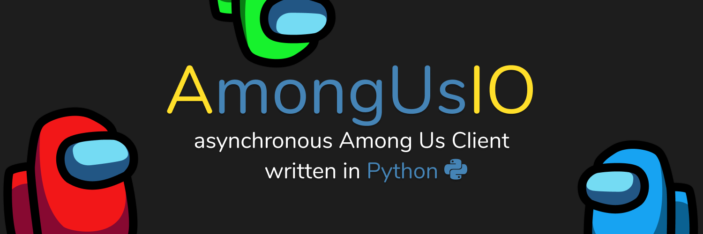

# AmongUsIO
[](https://gitlab.com/TECHNOFAB/amongusio/-/commits/master)
[](https://pypi.org/project/amongus/)
[](https://pypi.org/project/amongus/)
[](https://tecf.de/amongusio-discord)
[](https://www.python.org/)
[](https://github.com/psf/black)

Asynchronous Python Among Us Client

#### Note
> This repository is mirrored from [Gitlab][gitlab-repo] to [Github][github-repo].
> 
> Most features like Issues, MRs etc. are disabled on [Github][github-repo], please use the
> [Gitlab repository][gitlab-repo] for these

## Installation
```sh
git clone https://gitlab.com/TECHNOFAB/amongusio
// or 
git clone https://github.com/TECHNOFAB11/amongusio

cd amongusio
python -m pip install . 
```

## Example
```python
import amongus

client = amongus.Client(name="Bot")

client.run(region="EU")
```
> see [the examples folder](examples) for more


[gitlab-repo]: https://gitlab.com/TECHNOFAB/amongusio
[github-repo]: https://github.com/TECHNOFAB11/amongusio

## Roadmap / TODO

> see [TODO.md](TODO.md)
